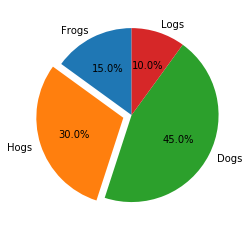
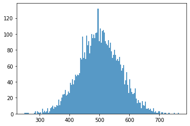
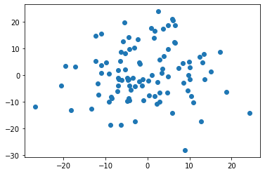

## 其他图像示例


```
import matplotlib.pyplot as plt
import numpy as np

labels=['Frogs','Hogs','Dogs','Logs']
sizes=[15,30,45,10]
explode=(0,0.1,0,0)
plt.pie(sizes,explode=explode,labels=labels,autopct='%1.1f%%',shadow=False,startangle=90)
plt.show()
```





```
mu,sigma=500,70
a=np.random.normal(mu,sigma,5000)
plt.hist(a,150,normed=0,histtype='stepfilled',alpha=0.75)
plt.show()
```

    /usr/local/lib/python3.6/dist-packages/ipykernel_launcher.py:3: MatplotlibDeprecationWarning: 
    The 'normed' kwarg was deprecated in Matplotlib 2.1 and will be removed in 3.1. Use 'density' instead.
      This is separate from the ipykernel package so we can avoid doing imports until





```
plt.plot(10*np.random.randn(100),10*np.random.randn(100),'o')
plt.show()
```




